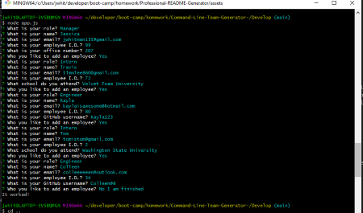

# Command Line Team Generator

- View the GitHub [repository](https://github.com/Jessica264365/Command-Line-Team-Generator)
- View the [video demonstration](https://drive.google.com/file/d/1wfdKHePZ4AZ31h7RprAEPCmDeJjRMdc4/view)

## Table of Contents

- [About the Project](https://github.com/Jessica264365/Command-Line-Team-Generator#about-the-project)
  - [Usage](https://github.com/Jessica264365/Command-Line-Team-Generator#usage)

* [Start Your Own](https://github.com/Jessica264365/Command-Line-Team-Generator#start-your-own)
  - [Prerequisites](https://github.com/Jessica264365/Command-Line-Team-Generator#prerequisites)
  - [Installation](https://github.com/Jessica264365/Command-Line-Team-Generator#installation)

- [Test Instructions](https://github.com/Jessica264365/Command-Line-Team-Generator#test-instructions)
- [License](https://github.com/Jessica264365/Command-Line-Team-Generator#license)
- [Roadmap](https://github.com/Jessica264365/Command-Line-Team-Generator#roadmap)
- [Contribute](https://github.com/Jessica264365/Command-Line-Team-Generator#contribute)
- [My Contact Information](https://github.com/Jessica264365/Command-Line-Team-Generator#my-contact-information)

## About the Project

This is a command line team generator. It creates a team.html file that can be displayed in the browser. Anyone can use this to keep their employee information organized. When the application is running in Node.js the user is prompted to choose whether they would like to enter a manager, an intern or engineer. Depending on which role they choose additional questions are asked. Once an employee has been entered the user either has the option to enter another person or complete their entries. Once the user has entered everyone and selects "No I am Finished" a file called team.html will be created in the output folder. The webpage will display all the team members that have been entered in an organized fashion.

 

### Usage

This application uses different JavaScript classes for each role to determine the series of questions asked. Here is a [video demonstration](https://drive.google.com/file/d/1wfdKHePZ4AZ31h7RprAEPCmDeJjRMdc4/view) of the application in action.

## Start Your Own

To get a copy of this project on your local computer please follow these next steps.

### Prerequisites

For this application you will need to have a git bash terminal (just bash for Mac users), Node.js, the inquirer npm package, the jest npm package (if you want to run test) and the fs npm package.

Clone the GitHub repository: git@github.com:Jessica264365/Command-Line-Team-Generator.git

### Installation

To get started with this application fork the project for your own GitHub. Clone the repository and navigate to the folder containing the package.json. Do a npm install and install all the dependancies. Lastly run the app.js file in Node.

### Test Instructions

Use the jest npm packpage to run the test for this application. Once jest is installed do an "npm run test". If you choose to change the code make sure to update the test as well.

## License

### MIT License

A short and simple permissive license with conditions only requiring preservation of copyright and license notices. Licensed works, modifications, and larger works may be distributed under different terms and without source code.

## Roadmap

This project does not currently have an open issues. Please check the [issues](https://github.com/Jessica264365/Command-Line-Team-Generator/issues) page on GitHub for any updates.

## Contribute

Feel free to create a pull request. If you are making major changes please open an issue so it can be discussed.

## My Contact Information

Email: jwhitman135@gmail.com

GitHub Page: [Jessica264365](https://github.com/Jessica264365)
